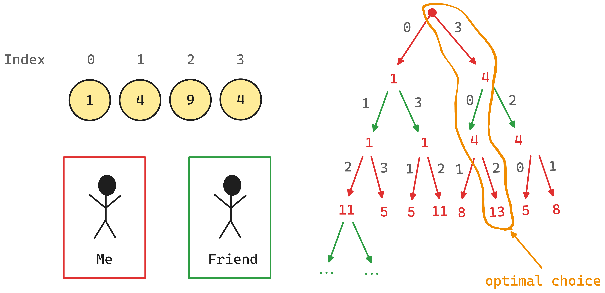

Week 02: Dynamic Programming
===
{: .no_toc }

  

    Table of contents
  

  {: .text-delta }
1. TOC
{:toc}

# Beach Bars 	

**Goal:** Find best location for the beach bar by minimizing the maximum distance that any of potential customers within the radius of 100 m must walk.

  

    Input
  

  {: .text-delta }
  - We have the total number `n` and the coordinates of the parasols, where coordinates are also integers (positive & negative) relative to the origin (the parking lot).
{:toc}

  

    Output
  

  {: .text-delta }
  - 1st line with `max_no_of_parasols` `[space]` `min_longest_dist`
  - 2nd line with coordinates of all possible optimal locations, sorted from low to high
{:toc}

  *Optimality of the location `x`*
  - A location x on the beach can only have integer coordinates and is optimal if the number of parasols within 100m of it (i.e. with coordinates in `[x − 100, x + 100]`) is maximal with respect to all other locations on the beach. 
    - If many locations maximize the number of parasols we only want those such that the distance to the farthest parasol at most 100m away is minimized.

## Solution Technique

The parasols each associates with an `int` value as its coordinate on a 1D line, and therefore it appears natural to have the container that contains the coordinates **sorted**.

The optimality of the solution is determined by the following two criteria:

1. Number of parasols within the range (to be maximized) `max_num`
2. Minimum distance to the furthest parasol (to be minimized) `min_dist`
  - the min distance would be the center

To find the optimal solution, we need to find a way to **iterate** over the parasol coordinates while keeping track of the above criteria and update values accordingly. Having criteria also implicitly implies that we shall have **case distinctions** for updating `max_num` and `min_dist`, when comparing them against the values computed from the current iteration.

### Sliding Window (SW)

The problem setup includes a fixed size window of size `200` meters, which is suitable for using the SW technique. 

We use two pointers `left` and `right`, each represent an index to access a parasol coordinate in the container. We use it for keeping track of the parasols that fit into the fixed-size window in the current iteration.

## Edge Case: Parity

To find the center within an interval, we can simply divide the interval by two. However, we are considering `int` coordinates, and for odd intervals, we need to take two centers that are equally good for the 2nd criterion into account.

We perform a division check using the standard `std::div` function, and fetch the remainder `div_res.rem` and the quotient `div_res.quot` from the `div_res` object.

# Burning Coins

  

    Input
  

  {: .text-delta }
We have total number of `n` coins, each associated with a positive integer value $$1 \leq v_{i} \leq 2500$$

{:toc}

  

    Output
  

  {: .text-delta }
  single line of largest winning `max_win`

{:toc}

## Problem Modeling

## Solution Technique

In this exercise we shall not sort and coins but need to preserve its original ordering.

The overall technique boils down to recursive calls with memoization and with a time complexity of $$O(n^{2})$$.

{: .note }
[LeetCode 877. Stone Game](https://leetcode.com/problems/stone-game/description/) is a very similar exercise that inspired this solution technique. See [this](https://www.youtube.com/watch?v=k4BPLBtXCWg&list=LL&index=1) YouTube video to see how this problem is tackled.

# Defensive Line 	

  

    Input
  

  {: .text-delta }

{:toc}

  

    Output
  

  {: .text-delta }

{:toc}

{: .note }
[LeetCode 698. Partition to K Equal Sum Subsets](https://leetcode.com/problems/partition-to-k-equal-sum-subsets/description/) (Medium) and [LeetCode 689. Maximum Sum of 3 Non-Overlapping Subarrays](https://leetcode.com/problems/maximum-sum-of-3-non-overlapping-subarrays/description/) (Hard).

# The Great Game

  

    Input
  

  {: .text-delta }

{:toc}

  

    Output
  

  {: .text-delta }

{:toc}

