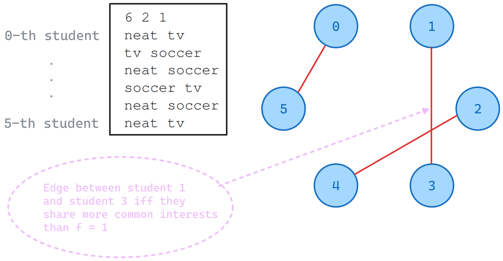

Week 03: 
===
{: .no_toc }

  

    Table of contents
  

  {: .text-delta }
1. TOC
{:toc}

# PoW: James Bond's Sovereigns

- Goal: find the largest possible winnings that passenger $$p_{k}$$ can collect regardless of how other passengers play

**Splitting procedure of passengers**

Passengers act in order
- $$p_{0}$$ can pick
  - left most $$s_{0}$$ or right most $$s_{n-1}$$

One cycle, starts with $$p_{0}$$, ends with $$p_{m-1}$$
- For $$p_{1}$$
  - if $$s_{0}$$ picked: choice between $${s_{1}, s_{n-1}}$$
  - if $$s_{n-1}$$ picked: choice between $${s_{0}, s_{n-2}}$$

The cycle starts with $$p_{0}$$ again and repeats until no coins left.

# First steps with BGL

**Goal:** Given a connected, weighted, undirected graph, compute the total weight of its minimum spanning tree and the distance from node `0` to a node furthest from it.

  

    Input
  

  {: .text-delta }
- 1st line with no. vertices `n` and no. edges `m` of the graph
- m consecutive lines, each with three integers representing a weighted edge 
  - `ep1 [space] ep2 [space] edge_weight`
  - non-negative weights at most 1000
{:toc}

  

    Output
  

  {: .text-delta }
- single line of `w` the sum of weights of all edges of a minimum spanning tree, and `d` the distance from node `0` to a node furthest from it.
  - `w [space] d`
{:toc}

## Solution Technique
- this exercise serves as a gentle introduction to the boost graph library
- to find the MST one uses the [Kruskal's Algorithm](./reference-graph-problems.html#using-kruskals-algorithm), and to obtain the distance from node `0` to a node furthest from it one can use [Dijkstra's Algorithm](./reference-graph-problems.html#using-dijkstras-algorithm).
- to iterate through the weighting map and subtract the sum of all weights one can use [`std::accumulate`](https://en.cppreference.com/w/cpp/algorithm/accumulate) and to find the maximum distance [`std::max_element`](https://en.cppreference.com/w/cpp/algorithm/max_element).

# Buddy Selection 	

  

    Input
  

  {: .text-delta }

- 1st line contains three integers `n [space] c [space] f`
  - `n` no. of students, an even number
  - `c` no. characteristics per students
  - `f` current maximum threshold of characteristics found over all pairs of students

- n lines describing characteristics of students, each line consists of `c` characteristics (`std::string`) per student
{:toc}

  

    Output
  

  {: .text-delta }

- single line determining if there is an assignment such that every pair shares more than `f` characteristics.
  - `optimal` 
  - `not optimal`
{:toc}

## Problem Modeling

We can use an unweighted, undirected graph [`graph`](./reference-bgl.html#unweighted-undirected-graph) to model the problem.

Every student is a vertex, and there is an edge between student `u` and `v` if and only if the number of common interests between them is strictly larger than the threshold `f` to be compared with.

An assignment for all students without leaving anyone alone is always possible because we have a one-to-one matching between students and the total number of students `n` is guaranteed to be an even number. A valid assignment $$M$$ is a set of edges where each vertex is contained in exactly one edge. An example of such matching $$M = \{ \{0, 5\}, \{1, 3\}, \{2, 4\} \}$$ is shown below.

## Solution Technique

An essential step for the graph construction consists of checking no. common interests between students, for this we need to perform pairwise comparisons between every student `i` and `j`. To do this efficiently, we can employ sliding window technique on the sorted container that contains students interests.

We notice that assignments $$M$$ are valid matching in graph problems and we can apply [Edmond’s Algorithm](./reference-graph-problems.html#using-edmonds-algorithm) on it.

# Ant Challenge 	

  

    Input
  

  {: .text-delta }

{:toc}

  

    Output
  

  {: .text-delta }

{:toc}

# Important Bridges

  

    Input
  

  {: .text-delta }

{:toc}

  

    Output
  

  {: .text-delta }

{:toc}

