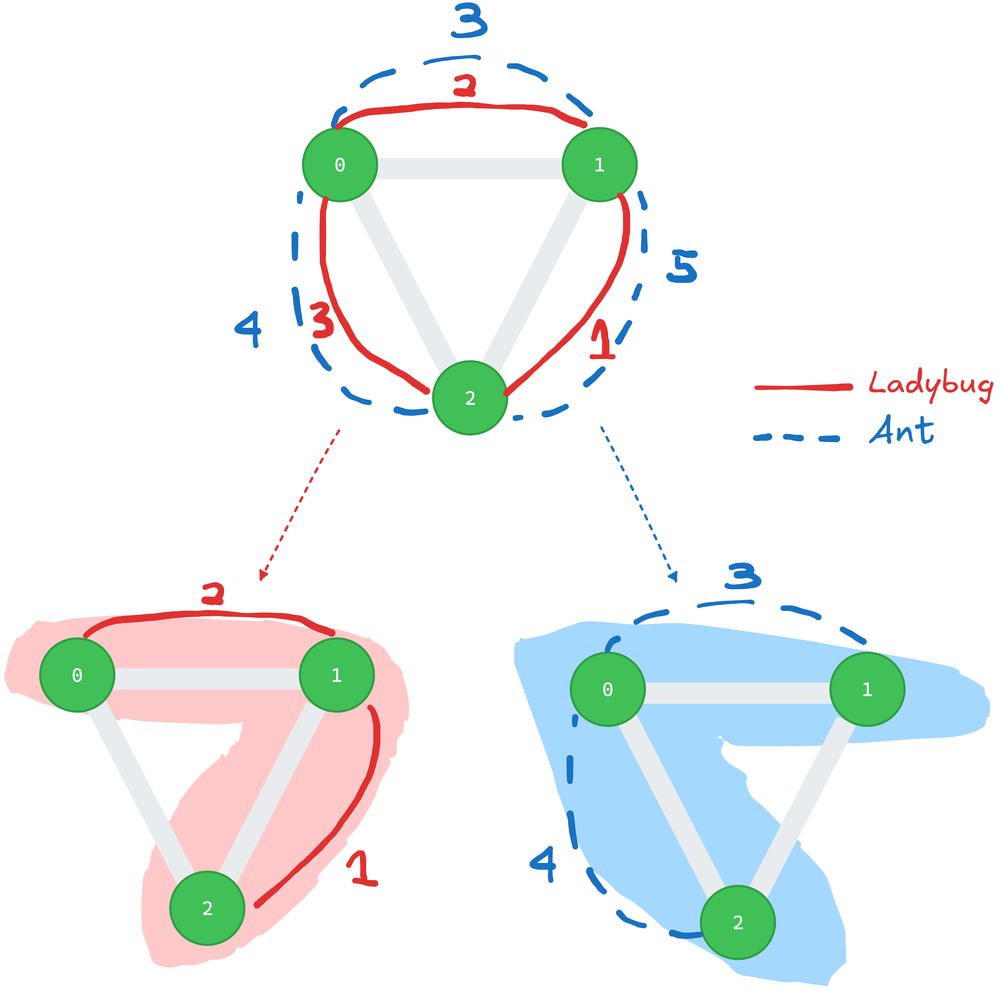

Week 03: 
===
{: .no_toc }

  

    Table of contents
  

  {: .text-delta }
1. TOC
{:toc}

# PoW: James Bond's Sovereigns

- Goal: find the largest possible winnings that passenger $$p_{k}$$ can collect regardless of how other passengers play

**Splitting procedure of passengers**

Passengers act in order
- $$p_{0}$$ can pick
  - left most $$s_{0}$$ or right most $$s_{n-1}$$

One cycle, starts with $$p_{0}$$, ends with $$p_{m-1}$$
- For $$p_{1}$$
  - if $$s_{0}$$ picked: choice between $${s_{1}, s_{n-1}}$$
  - if $$s_{n-1}$$ picked: choice between $${s_{0}, s_{n-2}}$$

The cycle starts with $$p_{0}$$ again and repeats until no coins left.

# First steps with BGL

**Goal:** Given a connected, weighted, undirected graph, compute the total weight of its minimum spanning tree and the distance from node `0` to a node furthest from it.

  

    Input
  

  {: .text-delta }
- 1st line with no. vertices `n` and no. edges `m` of the graph
- m consecutive lines, each with three integers representing a weighted edge 
  - `ep1 [space] ep2 [space] edge_weight`
  - non-negative weights at most 1000
{:toc}

  

    Output
  

  {: .text-delta }
- single line of `w` the sum of weights of all edges of a minimum spanning tree, and `d` the distance from node `0` to a node furthest from it.
  - `w [space] d`
{:toc}

## Solution Technique
- this exercise serves as a gentle introduction to the boost graph library
- to find the MST one uses the [Kruskal's Algorithm](./reference-graph-problems.html#using-kruskals-algorithm), and to obtain the distance from node `0` to a node furthest from it one can use [Dijkstra's Algorithm](./reference-graph-problems.html#using-dijkstras-algorithm).
- to iterate through the weighting map and subtract the sum of all weights one can use [`std::accumulate`](https://en.cppreference.com/w/cpp/algorithm/accumulate) and to find the maximum distance [`std::max_element`](https://en.cppreference.com/w/cpp/algorithm/max_element).

# Buddy Selection 	

  

    Input
  

  {: .text-delta }

- 1st line contains three integers `n [space] c [space] f`
  - `n` no. of students, an even number
  - `c` no. characteristics per students
  - `f` current maximum threshold of characteristics found over all pairs of students

- n lines describing characteristics of students, each line consists of `c` characteristics (`std::string`) per student
{:toc}

  

    Output
  

  {: .text-delta }

- single line determining if there is an assignment such that every pair shares more than `f` characteristics.
  - `optimal` 
  - `not optimal`
{:toc}

## Problem Modeling

We can use an unweighted, undirected graph [`graph`](./reference-bgl.html#unweighted-undirected-graph) to model the problem.

Every student is a vertex, and there is an edge between student `u` and `v` if and only if the number of common interests between them is strictly larger than the threshold `f` to be compared with.

An assignment for all students without leaving anyone alone is always possible because we have a one-to-one matching between students and the total number of students `n` is guaranteed to be an even number. A valid assignment $$M$$ is a set of edges where each vertex is contained in exactly one edge. An example of such matching $$M = \{ \{0, 5\}, \{1, 3\}, \{2, 4\} \}$$ is shown below.

## Solution Technique

An essential step for the graph construction consists of checking no. common interests between students, for this we need to perform pairwise comparisons between every student `i` and `j`. To do this efficiently, we can employ sliding window technique on the sorted container that contains students interests.

We notice that assignments $$M$$ are valid matching in graph problems and we can apply [Edmond’s Algorithm](./reference-graph-problems.html#using-edmonds-algorithm) on it.

# Ant Challenge 	

  

    Input
  

  {: .text-delta }
  - 1st line of `n [space] e [space] s [space] a [space] b`
    - no. trees
    - no. edges
    - no. species
    - index of start tree
    - index of end tree
  - e consecutive lines of `u [space] v [space] w₀ [...] wₛ₋₁` describing edges and cost for each species
  - 1 line of `h₀ [...] hₛ₋₁` location of hives of species
{:toc}

  

    Output
  

  {: .text-delta }
single line containing total cost on the optimal route fulfilling the private network constraint
{:toc}

## Problem Modeling

The graph construction for the undirected, weighted graph $$G = (V, E)$$ is defined by the task already. By task description, the graph itself represents a forest, with vertices being the trees and an edge is established between two trees if there is a path that connects them.

### Construction of Subgraphs

The concept of a "private network" is introduced and leads to subgraphs $$G_{i} := (V_i, E_i), i \in \{0, ..., s-1\}, V_i = V, E_i ⊆ E$$ one can construct from $$G$$, where $$s$$ is an integer number denoting the number of species.

For a species $$i$$, one can construct the "private network" with a greedy algorithm where one starts from some node (hive of the species) with index `h[i]`. At each iteration, some node $$q$$ from the set of unvisited neighboring nodes of the current node $$p$$ will be visted, such that $$\{ p, q \}$$ has the lowest weight. The iteration ends until $$\lvert V_i \rvert = \lvert V \rvert$$, when all vertices are covered in the subgraph.

We notice that it is describing Prim's algorithm for finding the minimum spanning tree (MST). Since all weights are unique, we can also use Kruskal's algorithm to find the MST, which is more suitable for sparse graphs.

### Construction of the Shortest Path

The shortest path algorithm should run on the union of subgraphs $$⋃_{i} G_{i}$$, where the weights on the edges are chosen from the minimum from all possible edge values. One can see that the found shortest path should be some set of edges fulfulling $$P ⊆ ⋃_{i} E_{i}$$

{: .warning}
  For every edge there are `s` possible weights, but not all of them can be used!

 Only those that belong to some edge in some $$G_{i}$$ can be chosen. Using the minimum out of all possible weights on an edge blindly is wrong.

 In the following example, we see that the edge $$\{0,2\}$$ is not part of the MST of the ladybug species, even though the weight of it is 3, which is lower than the weight that ant gives.

# Important Bridges

  

    Input
  

  {: .text-delta }

{:toc}

  

    Output
  

  {: .text-delta }

{:toc}

