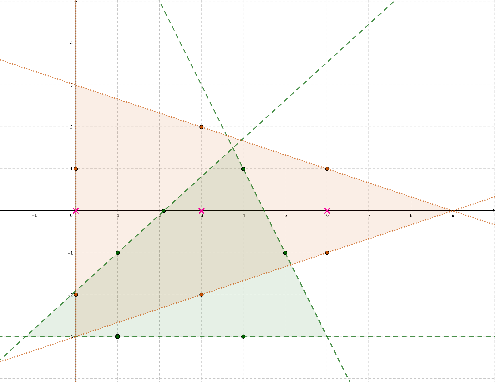

Week 04: Introduction to geometric computing in CGAL
===
{: .no_toc }

  

    Table of contents
  

  {: .text-delta }
1. TOC
{:toc}

# PoW: Tracking

## Problem Modeling

We can model the problem as an unweighted, undirected graph [`graph`](./reference-bgl.html#unweighted-undirected-graph)

# Hit

# First Hit

- the performance of the improved algorithm depends on the quality of the first found segment that intersects with the ray
- thus using random shuffle

# Antenna

# Hiking Maps

**Goal:** Find the minimum number of hiking map pieces that can cover all hiking legs (segments), while making sure at least every single leg is contained on a single map part.

  

    Input
  

  {: .text-delta }
  - 1st line of `m [space] n`
    - `m` no. stops on the hike, they form `m-1` legs 
    - `n` no. map parts
  - m lines of `q0x [space] q0y ... q5x [space] q5y` (6 points in all)
    - each line describes a map piece in the form of a 2D simplex (triangle)
    - `(q0x, q0y)` and `(q1x, q1y)` lie in the relative interior of an edge
{:toc}

{: .warning }
A "leg" in the problem statement refers to a hiking route, i.e. a segment in the graph. In inputs there are `m` points given, each represents a stop and two stops form a leg.

## Problem Modeling

### Minimum Cost

The assignment formula given by the task actually boils down to a restriction that we need to use map pieces of **consecutive** indices, it is suitable to use the **sliding window** technique to find such window. The cost formula is just counting how many map pieces are used.

### Lines as Decision Boundary

Each line in $$ℝ^{2}$$ is a hyperplane that divides the space into two halves and the decision boundary `CGAL::ON_ORIENTED_BOUNDARY` itself, we then can distinguish between a positive `CGAL::ON_POSITIVE_SIDE`, a negative side `CGAL::ON_NEGATIVE_SIDE` as described in the documentation for [CGAL::Line_2](https://doc.cgal.org/latest/Kernel_23/classCGAL_1_1Line__2.html).

### Defining a Simplex

To model a simplex, we need to first construct the three lines by using the input points that lie on the relative interior of each edge. We notice that the simplex is the only bounded domain formed by these lines, for each boundary line there is a "correct" side. If a point on the plane lie on the correct side for all three boundary lines, the point lies within the simplex. This motivates the fact that we need to keep track of the correct side for each line.

#### Finding the Correct Side for One Edge

Given the sample input as in the task description, we want to decide for the orange map piece, which side is the correct side for $$x = 0$$ (defined by `(0,1)`, `(0,-2)`). One can observe that the other points (e.g. `(3,2)`, `(6,1)`...) within the relative interior of other edges always lie on the "correct side". We use the member function `oriented_side(ep_adj)` of every `Line_2` to find out the correct side using some adjacent endpoint `ep_adj` on some other edges and record this.

### Checking if the Legs are Contained

To see if a point lies within (including on boundaries) the simplex, we need to check if the point line on the correct side or on the boundary. To check if a leg (segment) is contained within a simplex, we need to ensure both endpoints of the segment are contained.

